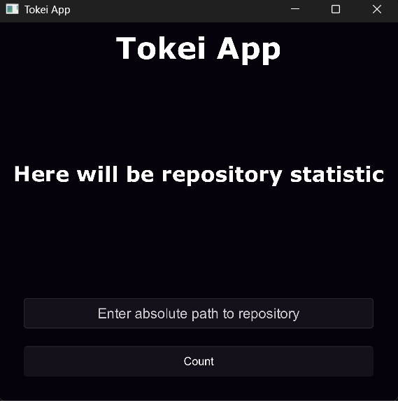

# Tokei App

---

Simple programm that allows you to see full statistic of each language in any repository(on your pc). 

After opening you'll need to write absolute path to repository and press "Count" button. Then you'll see statistic. 

> [!NOTE]
> After every "count" all statistic will save in data.json file. It will overwrite the previous statistic.

Made with Rust(core logic, tokei) and Slint.

---

## License

Tokei App is licensed under the **MIT License**.
